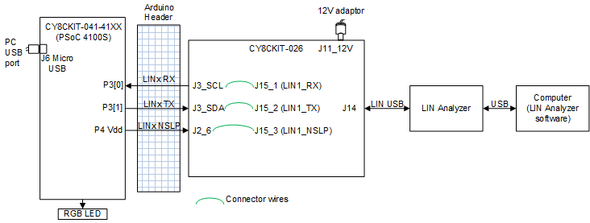
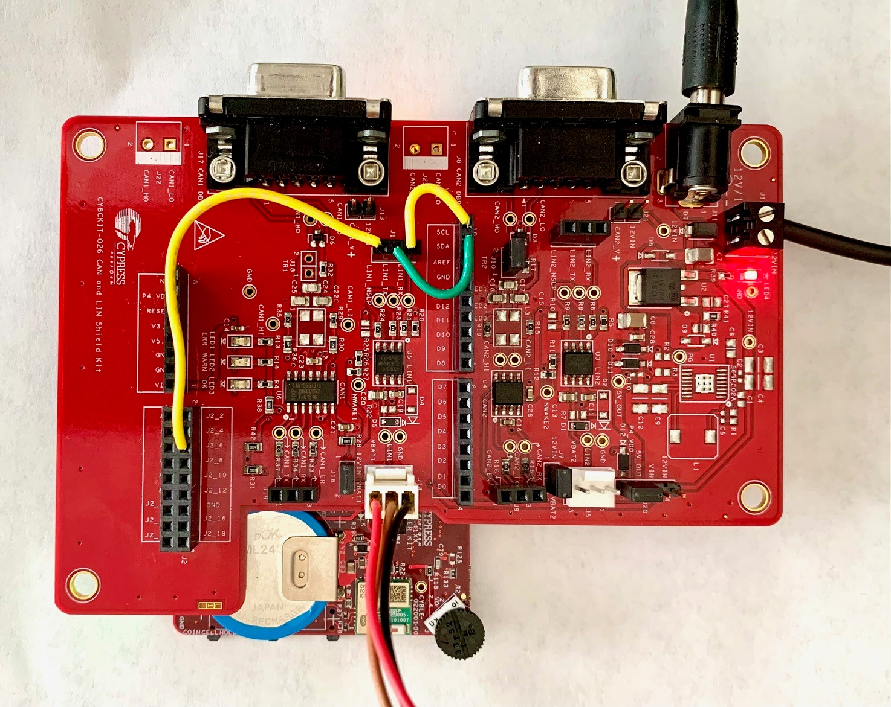
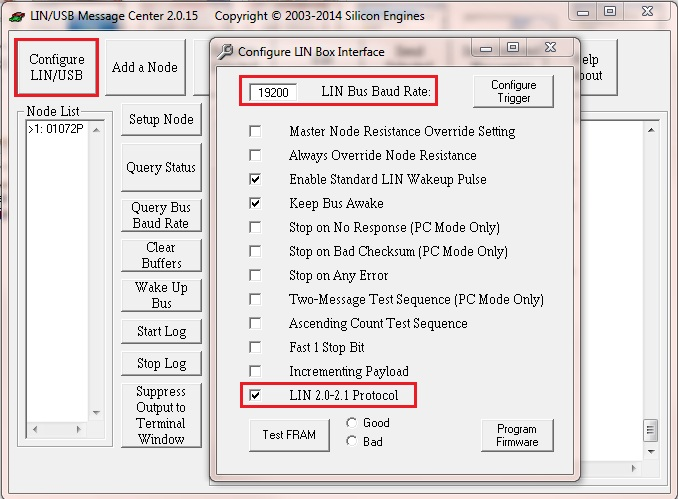
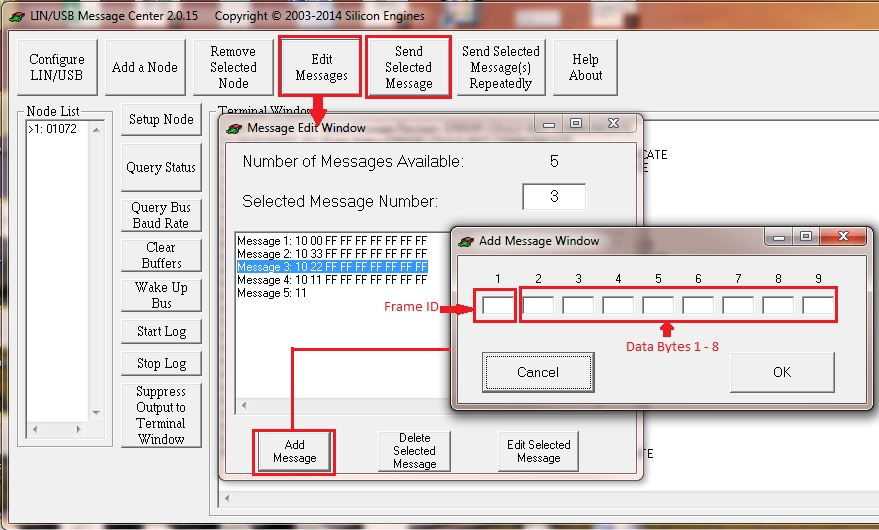
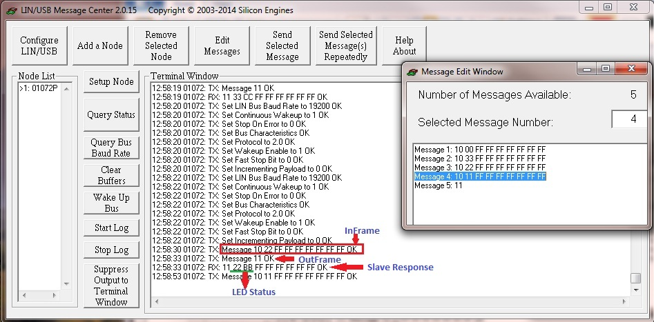
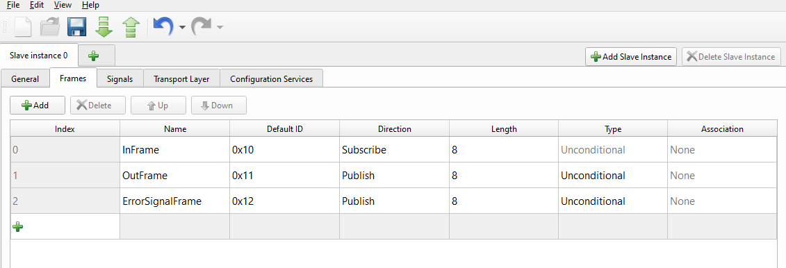
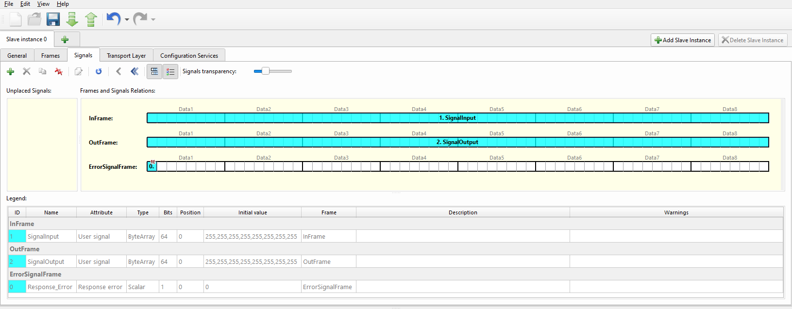

This code example shows how to implement a basic LIN 2.2 slave using the LIN Middleware in PSoC&trade; 4.
PSoC&trade; 4 responds to an external LIN Master's commands to:
1. Turn on the corresponding color LED on PSoC&trade; development kit
2. Report the current LED color status 

[Provide feedback on this code example.](https://cypress.co1.qualtrics.com/jfe/form/SV_1NTns53sK2yiljn?Q_EED=eyJVbmlxdWUgRG9jIElkIjoiQ0UyMzMxMjIiLCJTcGVjIE51bWJlciI6IjAwMi0zMzEyMiIsIkRvYyBUaXRsZSI6IiIsInJpZCI6Imtpa3UiLCJEb2MgdmVyc2lvbiI6IjEuMC4wIiwiRG9jIExhbmd1YWdlIjoiRW5nbGlzaCIsIkRvYyBEaXZpc2lvbiI6Ik1DRCIsIkRvYyBCVSI6IklDVyIsIkRvYyBGYW1pbHkiOiJQU09DIn0=)

## Requirements

- [ModusToolbox&trade; software](https://www.cypress.com/products/modustoolbox-software-environment) v2.3.1 or later

    **Note:** This code example version requires ModusToolbox&trade; software version 2.3.1 or later and is not backward compatible with v2.2 or older versions.
- Board support package (BSP) minimum required version: 1.2.0
- Programming language: C
- Associated parts: [PSoC&trade; 4100S](https://www.cypress.com/documentation/datasheets/psoc-4-psoc-4100s-family-datasheet-programmable-system-chip-psoc)

## Supported toolchains (make variable 'TOOLCHAIN')

- GNU Arm® embedded compiler v9.3.1 (`GCC_ARM`) - Default value of `TOOLCHAIN`
- Arm compiler v6.13 (`ARM`)
- IAR C/C++ compiler v8.42.2 (`IAR`)

## Supported kits (make variable 'TARGET')

- [CY8CKIT-041-41XX PSoC&trade; 4100S CAPSENSE&trade; Pioneer Kit](https://www.cypress.com/CY8CKIT-041-41XX) (`CY8CKIT-041-41XX`) - Default value of `TARGET`

A LIN transceiver is not available on the standard PSoC&trade; development kits. Hence, we need [CAN and LIN Shield Kit](https://www.cypress.com/CY8CKIT-026) (`CY8CKIT-026`) as a compatible shield kit to connect the LIN Tx and Rx signals from the PSoC to a LIN bus or an analyzer.

## Hardware setup

**Note:** Some of the PSoC&trade; 4 kits ship with KitProg2 installed. The ModusToolbox&trade; software requires KitProg3. Before using this code example, make sure that the board is upgraded to KitProg3. The tool and instructions are available in the [Firmware Loader](https://github.com/Infineon/Firmware-loader) GitHub repository. If you do not upgrade, you will see an error like "unable to find CMSIS-DAP device" or "KitProg firmware is out of date".

The hardware setup block diagram and connections are shown in [Figure 1](#figure-1-lin-slave-communication-hardware-setup); detailed hardware connections are explained below.

#### **Figure 1. LIN Slave Communication Hardware Setup**



**Note:** The CY8CKIT-41-41XX kit comes with an enclosure for a CAPSENSE&trade; trackpad. The enclosure should be opened and the Arduino headers available in the kit box should be mounted into respective headers.

[Figure 2](#figure-2-hardware-setup-using-cy8ckit-041-41xx-and-cy8ckit-026) shows the hardware setup using CY8CKIT-041-41XX and CY8CKIT-026.

#### **Figure 2. Hardware Setup using CY8CKIT-041-41XX and CY8CKIT-026**



Follow these instructions to set up the hardware:

1.	Because there are two LIN transceivers on CY8CKIT-026, choose either of the transceivers to use (U5 – LIN1 transceiver or U3 – LIN2 transceiver). Connect the Arduino header pins (which are connected to the base board controller) to the appropriate LIN transceiver using jumper wires as shown in [Table 1](#table-1-pin-connections-on-cy8ckit-026).

#### **Table 1. Pin Connections on CY8CKIT-026**

| Arduino Header Pins | LIN1 transceiver | LIN2 transceiver |
| ------ | ------            | ------   |
| J3_SCL | J15_1 (LIN1_RX)   | J6_1 (LIN2_RX) |
| J3_SDA | J15_2 (LIN1_TX)   | J6_2 (LIN2_TX) |
| J2_6   | J15_3 (LIN1_NSLP) | J6_3 (LIN2_NSLP) |

2.	Make sure that jumper J16 (if the LIN1 transceiver is being used) is shorted or jumper J7 (if the LIN2 transceiver is being used) is shorted.

**Note:** This is to provide a 12 V supply to the Silicon Engines LIN-USB analyzer; if any other analyzer is being used, then follow the instructions for power supply requirements and short the jumper only if it requires a 12 V supply.

3.	The baseboard (PSoC&trade; 4 kit) can be powered using USB or it can be powered from the Shield kit by selecting jumper J20 appropriately as shown in [Table 2](#table-2-powering-options-with-jumper-20). See the [CY8CKIT-026 user guide](http://www.cypress.com/CY8CKIT-026) for more details.

#### **Table 2. Powering Options with Jumper (J20)**

| J20 Connection | Power Option | Baseboard (CY8CKIT-041-41XX) Requirement|
| ------ | ------ | ------ |
| Short pin 2 and 3 | Power baseboard using Shield Kit with 5 V | Baseboard power selection jumper (J10 on CY8CKIT-041-41XX) <br>should be at 3.3 V (only if USB is not connected to the baseboard). |
| Short pin 3 and 4 | Power baseboard using Shield Kit with 12 V | Baseboard power selection jumper (J9 on CY8CKIT-041-41XX) <br>should be at 3.3 V (only if USB is not connected to the baseboard). |

**Note**: If the baseboard is powered through USB, and a 12 V supply is connected to the Shield Kit, the position of the power jumper selection (J20) is not significant.

4. Verify switch configurations on the baseboard as below [Table 3](#table-3-switch-configurations-on-cy8ckit-041-41xx):

#### **Table 3. Switch Configurations on CY8CKIT-041-41XX**

| Switch Number | Position | Comment |
| ------ | ------ | ------ |
| SW4 | VREG/VBUS | Power PSoC&trade; using on-board regulator or directly through Vbus |
| SW5 | POS 1 | Connect SWD pins from KitProg to PSoC&trade; 4100S |
| SW6 | POS3 (5.0V) | Configure PSoC&trade; MCU's Vdd to be 5V. It should be set to 3.3V when baseboard is powered by 5V/12V from the Shield kit |
| SW7 | Only P5 is ON | No power monitoring required |

5.	Plug in CY8CKIT-026 to CY8CKIT-041-41XX through the Arduino-compatible connectors.

6.	Connect the LIN analyzer to the J14 connector to use LIN1 transceiver or J5 connector to use LIN2 transceiver. 

**Warning**: Be careful to not power up the Shield Kit with multiple supplies.

7.	If the LIN analyzer DOES NOT provide 12 V to the VBAT pin, connect a 12 V supply to CY8CKIT-026 through the J11 power jack or J12 screw terminal connector.

8.	If the LIN analyzer DOES provide 12 V to the VBAT pin, the Shield kit can be powered from the LIN analyzer if desired without an external 12 V supply. For that configuration, the J16 jumper (for LIN1 transceiver) or the J7 jumper (LIN2 transceiver) should be placed. 

**Note**: The Silicon Engines LIN-USB analyzer requires a 12 V input supply, so either J16 (for LIN1) or J7 (for LIN2) must be placed and an external 12 V supply must be provided to J11 power jack or J12 screw terminal connector.

## Software setup

Install the LIN analyzer’s corresponding PC software. In this code example, we have used LIN/USB Message Center software.

## Using the code example

Create the project and open it using one of the following:

<details><summary><b>In Eclipse IDE for ModusToolbox&trade;</b></summary>

1. Click the **New Application** link in the **Quick Panel** (or, use **File** > **New** > **ModusToolbox Application**). This launches the [Project Creator](http://www.cypress.com/ModusToolboxProjectCreator) tool.

2. Pick a kit supported by the code example from the list shown in the **Project Creator - Choose Board Support Package (BSP)** dialog.

   When you select a supported kit, the example is reconfigured automatically to work with the kit. To work with a different supported kit later, use the [Library Manager](https://www.cypress.com/ModusToolboxLibraryManager) to choose the BSP for the supported kit. You can use the Library Manager to select or update the BSP and firmware libraries used in this application. To access the Library Manager, click the link from the **Quick Panel**.

   You can also just start the application creation process again and select a different kit.

   If you want to use the application for a kit not listed here, you may need to update the source files. If the kit does not have the required resources, the application may not work.

3. In the **Project Creator - Select Application** dialog, choose the example by enabling the check box.

4. Optionally, change the suggested **New Application Name**.

5. Enter the local path in the **Application(s) Root Path** field to indicate where the application needs to be created.

   Applications that can share libraries can be placed in the same root path.

6. Click **Create** to complete the application creation process.

For more details, see the [Eclipse IDE for ModusToolbox&trade; User Guide](https://www.cypress.com/MTBEclipseIDEUserGuide) (locally available at *{ModusToolbox install directory}/ide_{version}/docs/mt_ide_user_guide.pdf*).

</details>

<details><summary><b>In command-line interface (CLI)</b></summary>

ModusToolbox&trade; provides the Project Creator as both a GUI tool and a command line tool to easily create one or more ModusToolbox&trade; applications. See the "Project Creator Tools" section of the [ModusToolbox&trade; User Guide](https://www.cypress.com/ModusToolboxUserGuide) for more details.

Alternatively, you can manually create the application using the following steps:

1. Download and unzip this repository onto your local machine, or clone the repository.

2. Open a CLI terminal and navigate to the application folder.

   On Windows, use the command line `modus-shell` program provided in the ModusToolbox&trade; installation instead of a standard Windows command line application. This shell provides access to all ModusToolbox&trade; tools. You can access it by typing `modus-shell` in the search box in the Windows menu.

   In Linux and macOS, you can use any terminal application.

   **Note:** The cloned application contains a default BSP file (*TARGET_xxx.mtb*) in the *deps* folder. Use the [Library Manager](https://www.cypress.com/ModusToolboxLibraryManager) (`make modlibs` command) to select and download a different BSP file, if required. If the selected kit does not have the required resources or is not [supported](#supported-kits-make-variable-target), the application may not work.

3. Import the required libraries by executing the `make getlibs` command.

Various CLI tools include a `-h` option that prints help information to the terminal screen about that tool. For more details, see the [ModusToolbox&trade; User Guide](https://www.cypress.com/ModusToolboxUserGuide) (locally available at *{ModusToolbox install directory}/docs_{version}/mtb_user_guide.pdf*).

</details>

<details><summary><b>In Third-party IDEs</b></summary>

1. Follow the instructions from the **In command-line interface (CLI)** section to create the application, and import the libraries using the `make getlibs` command.

2. Export the application to a supported IDE using the `make <ide>` command.

   For a list of supported IDEs and more details, see the "Exporting to IDEs" section of the [ModusToolbox&trade; User Guide](https://www.cypress.com/ModusToolboxUserGuide) (locally available at *{ModusToolbox install directory}/docs_{version}/mtb_user_guide.pdf*.

3. Follow the instructions displayed in the terminal to create or import the application as an IDE project.

</details>

## Operation

To test the project, a “Silicon Engines LIN-USB Converter – Model 9011” is used as LIN analyzer. Other LIN analyzers may also be used.

Follow these  steps to test the project:

1.	Make the hardware connections as described in the [Hardware Setup](#hardware-setup) section.

2. Program the baseboard (CY8CKIT-041-41XX) using one of the following:

   <details><summary><b>Using Eclipse IDE for ModusToolbox&trade;</b></summary>

      1. Select the application project in the Project Explorer.

      2. In the **Quick Panel**, scroll down, and click **\<Application Name> Program (KitProg3_MiniProg4)**.
      </details>

   <details><summary><b>Using CLI</b></summary>

     From the terminal, execute the `make program` command to build and program the application using the default toolchain to the default target. You can specify a target and toolchain manually:
      ```
      make program TARGET=<BSP> TOOLCHAIN=<toolchain>
      ```

      Example:
      ```
      make program TARGET=CY8CKIT-041-41XX TOOLCHAIN=GCC_ARM
      ```
</details>

4. Install the ‘SE9004 and 9011 LINUSB Message Center’ software (if a different analyzer is being used, install the appropriate software) on your PC.

5. Connect the LIN analyzer to a PC through a USB cable and open the LIN analyzer software in PC.

6. On the LIN analyzer software, go to **Configure LIN/USB**. The Configure LIN Box Interface window is displayed. Set the **LIN Bus Baud Rate** to 19200 bps, and then select the **LIN 2.0-2.1 Protocol** checkbox, as shown in [Figure 3](#figure-3-lin-analyzer-configurations).

#### **Figure 3. LIN Analyzer Configurations**



7. If you are using any other analyzer, make sure that the checksum setting is selected as enhanced checksum since LIN v2.1/2.2 specification supports only enhanced checksum (this option is not required in Silicon Engines LIN-USB converter software).

8. Add the message in the analyzer software that should be transmitted to the slave and send it through the analyzer, as shown in [Figure 4](#figure-4-adding-and-sending-message-using-lin-analyzer), Note that the message must start with the ID.

#### **Figure 4. Adding and Sending Message Using LIN Analyzer**



9. If a frame with ID = 0x10 is received from the master (analyzer), the slave controls the baseboard LEDs based on the received data command from the master as shown in [Table 4](#table-4-slave-response-per-commands-from-master). Note that the message must start with the ID and must contain eight data bytes even though only the first byte is used to control the LEDs. The other seven data bytes can be any value.

#### **Table 4. Slave Response per Commands from Master**

| Command   | Slave Response              |
| ------    | ------                      |
| 0x11      | Turns on LED1 (Red LED)     |
| 0x22      | Turns on LED2 (Green LED) |
| 0x33      | Turns on LED3 (Blue LED) |
| 0x00      | Turns off all LEDs          |

10. If a frame with ID = 0x11 is received from the master (analyzer), then the slave sends the status of baseboard LEDs back to the master as shown in [Table 5](#table-5-led-status). The message in this case only needs the message ID. No data bytes are required.

#### **Table 5. LED Status**

| LED Status on PSoC kit   | Data byte |
| ------                   | ------    |
| LED1 (Red LED) on        | 0xAA      |
| LED2 (Green LED) on    | 0xBB      |
| LED3 (Blue LED) on    | 0xCC      |
| All LEDs off             | 0xDD      |

**Note**: In this example, PSoC&trade; 4 (LIN Slave) sends the status of previously received command as the first byte and the current status of LEDs as the second byte.

11. The result of transmitted and received data at the LIN analyzer is shown in [Figure 5](#figure-5-results-at-lin-analyzer).

#### **Figure 5. Results at LIN Analyzer**



In this figure, InFrame refers to “10 22 FF FF FF FF FF FF FF” where 10 is the frame ID and 22, FF, FF, FF, FF, FF, FF, FF are the eight data bytes. As PSoC&trade; 4 needs only the first data byte for the command, remaining bytes can be ignored. When the 'OutFrame' is received from the analyzer (LIN Master) as marked in this figure, the slave responds to the frame with the current LED status along with the frame ID and previously received command as “11 22 BB” where '11' is frame ID, '22' is the previous 'InFrame' data byte (command) and 'BB' is the LED status (i.e., LED2 is ON).

**Note:** If there is an error message such as “BUS STUCK HIGH” or “TX FRAME ERROR”, reset the baseboard (CY8CKIT-041-41XX) and LIN analyzer.

## Debugging

You can debug the example to step through the code. In the Eclipse IDE, use the **\<Application Name> Debug (KitProg3_MiniProg4)** configuration in the **Quick Panel**. For more details, see the "Program and debug" section in the [Eclipse IDE for ModusToolbox&trade; User Guide](https://www.cypress.com/MTBEclipseIDEUserGuide).

## Design and implementation

The following screenshots show the parameter settings for the LIN configurator. Only the parameters that vary from their default values are shown.

[Figure 6](#figure_6_lin_configurator_frames_tab_settings) shows the Frames tab settings for the LIN configurator. Use this tab to add a new frame or delete an existing frame from the LIN slave. Click the ‘Add’ button to add a new frame. For this example, three frames named “InFrame”, “OutFrame” and “ErrorSignalFrame” are used as shown in [Figure 6](#figure_6_lin_configurator_frames_tab_settings).

**InFrame**: The frame ID value is 0x10, the direction of the frame is ‘Subscribe’ and the frame type is ‘Unconditional’.
**OutFrame**: The frame ID value is 0x11, the direction of the frame is ‘Publish’ and the frame type is ‘Unconditional’.
**ErrorSignalFrame**: The frame ID value is 0x12, the direction of the frame is ‘Publish’ and the frame type is ‘Unconditional’.

**Note**: If the direction (publish/subscribe) is set as ‘Publish’, the slave responds to master; if the direction is set as ‘Subscribe’, the slave uses the received data from the master for its application.

#### **Figure 6. LIN Configurator Frames Tab Settings**



[Figure 7](#figure_7_lin_configurator_signals_tab_settings) shows the Signals tab settings of the LIN Configurator. Click the ‘+’ button to add new signals and select the signal properties such as signal name, type, length and initial value. Place the signals to the corresponding frames as shown below.

#### **Figure 7. LIN Configurator Signals Tab Settings**



All other configuration settings are left at their default settings.

## Resources and settings

[Table 6](#table-6-modustoolbox-resources) lists some of the ModusToolbox&trade; resources used in the example, and how they are used in the design. The design.modus file contains all the configuration settings. For example, for pin usage and configuration, open the Pins tab of the design file.

#### **Table 6. ModusToolbox&trade; Resources**

| Resource              |  Alias/Object            |    Purpose                                                                           |
| :-------              | :------------            | :------------                                                                        |
| SCB  (LIN Middleware) | LIN                      | Provide communication between the LIN Master <br>(external analyzer) and the Slave   |
| GPIO (LIN Middleware) | LIN_TX_PIN, LIN_RX_PIN   | LIN Slave controller pins                                                            |
| GPIO (HAL)            | LED1_PIN, LED2_PIN, <br>LED3_PIN  | LED pins on CY8CKIT-041-41XX Kit                       |

## Related resources

| Resources         |  Links                                           |
| :--------------   | :---------------------------------------         |
| Application notes | [AN79953](https://www.cypress.com/AN79953) – Getting Started with PSoC&trade; 4 |
| Code examples     | [Using ModusToolbox&trade;](https://github.com/Infineon/Code-Examples-for-ModusToolbox-Software) software on GitHub <br>  [Using PSoC&trade; Creator](https://www.cypress.com/search/all?f%5B0%5D=meta_type%3Asoftware_tools&f%5B1%5D=software_tools_meta_type%3A579&f%5B2%5D=field_related_products%3A1300&f%5B3%5D=field_related_products%3A1299&f%5B4%5D=field_related_products%3A1298&f%5B5%5D=field_related_products%3A91336&f%5B6%5D=field_related_products%3A125906) |
| Device documentation | [PSoC&trade; 4 MCU datasheets](<https://www.cypress.com/search/all/PSOC%204%20datasheets?sort_by=search_api_relevance&f%5B0%5D=meta_type%3Atechnical_documents>) <br> [PSoC&trade; 4 technical reference manuals](<https://www.cypress.com/search/all/PSoC%204%20Technical%20Reference%20Manual?sort_by=search_api_relevance&f%5B0%5D=meta_type%3Atechnical_documents>) |
| Development kits     | Visit www.cypress.com/microcontrollers-mcus-kits and use the options in the **Select your kit** section to filter kits by *Product family* or *Features*. <br> [CY8CKIT-041-41XX](https://www.cypress.com/CY8CKIT-041-41XX) PSoC&trade; 4100S CAPSENSE&trade; Pioneer Kit <br> [CY8CKIT-026](https://www.cypress.com/CY8CKIT-026) CAN and LIN Shield Kit |
| Libraries on GitHub  | [mtb-pdl-cat2](https://github.com/Infineon/mtb-pdl-cat2) – PSoC&trade; 4 peripheral driver library (PDL) <br>  [mtb-hal-cat2](https://github.com/Infineon/mtb-hal-cat2) – Hardware abstraction layer (HAL) library |
| Middleware on GitHub | [lin](https://github.com/Infineon/lin) LIN library and documents |
| Tools                | [Eclipse IDE for ModusToolbox&trade; software](https://www.cypress.com/modustoolbox) – ModusToolbox&trade; software is a collection of easy-to-use software and tools enabling rapid development with Infineon MCUs, covering applications from embedded sense and control to wireless and cloud-connected systems using AIROC&trade; Wi-Fi and Bluetooth® connectivity devices. <br> [PSoC&trade; Creator](https://www.cypress.com/products/psoc-creator-integrated-design-environment-ide) – IDE for PSoC&trade; and FM0+ MCU development       |

## Other resources

Cypress provides a wealth of data at www.cypress.com to help you select the right device, quickly and effectively integrate it into your design.

## Document history

Document title: *CE233122* - *PSoC&trade; 4: Basic LIN Slave Example in MTB*

| Version | Description of Change |
| ------- | --------------------- |
| 1.0.0   | New code example      |
------

-------------------------------------------------------------------------------

© Cypress Semiconductor Corporation, 2021. This document is the property of Cypress Semiconductor Corporation, an Infineon Technologies company, and its affiliates ("Cypress").  This document, including any software or firmware included or referenced in this document ("Software"), is owned by Cypress under the intellectual property laws and treaties of the United States and other countries worldwide.  Cypress reserves all rights under such laws and treaties and does not, except as specifically stated in this paragraph, grant any license under its patents, copyrights, trademarks, or other intellectual property rights.  If the Software is not accompanied by a license agreement and you do not otherwise have a written agreement with Cypress governing the use of the Software, then Cypress hereby grants you a personal, non-exclusive, nontransferable license (without the right to sublicense) (1) under its copyright rights in the Software (a) for Software provided in source code form, to modify and reproduce the Software solely for use with Cypress hardware products, only internally within your organization, and (b) to distribute the Software in binary code form externally to end users (either directly or indirectly through resellers and distributors), solely for use on Cypress hardware product units, and (2) under those claims of Cypress’s patents that are infringed by the Software (as provided by Cypress, unmodified) to make, use, distribute, and import the Software solely for use with Cypress hardware products.  Any other use, reproduction, modification, translation, or compilation of the Software is prohibited.
<br>
TO THE EXTENT PERMITTED BY APPLICABLE LAW, CYPRESS MAKES NO WARRANTY OF ANY KIND, EXPRESS OR IMPLIED, WITH REGARD TO THIS DOCUMENT OR ANY SOFTWARE OR ACCOMPANYING HARDWARE, INCLUDING, BUT NOT LIMITED TO, THE IMPLIED WARRANTIES OF MERCHANTABILITY AND FITNESS FOR A PARTICULAR PURPOSE.  No computing device can be absolutely secure.  Therefore, despite security measures implemented in Cypress hardware or software products, Cypress shall have no liability arising out of any security breach, such as unauthorized access to or use of a Cypress product.  CYPRESS DOES NOT REPRESENT, WARRANT, OR GUARANTEE THAT CYPRESS PRODUCTS, OR SYSTEMS CREATED USING CYPRESS PRODUCTS, WILL BE FREE FROM CORRUPTION, ATTACK, VIRUSES, INTERFERENCE, HACKING, DATA LOSS OR THEFT, OR OTHER SECURITY INTRUSION (collectively, "Security Breach").  Cypress disclaims any liability relating to any Security Breach, and you shall and hereby do release Cypress from any claim, damage, or other liability arising from any Security Breach.  In addition, the products described in these materials may contain design defects or errors known as errata which may cause the product to deviate from published specifications.  To the extent permitted by applicable law, Cypress reserves the right to make changes to this document without further notice. Cypress does not assume any liability arising out of the application or use of any product or circuit described in this document.  Any information provided in this document, including any sample design information or programming code, is provided only for reference purposes.  It is the responsibility of the user of this document to properly design, program, and test the functionality and safety of any application made of this information and any resulting product.  "High-Risk Device" means any device or system whose failure could cause personal injury, death, or property damage.  Examples of High-Risk Devices are weapons, nuclear installations, surgical implants, and other medical devices.  "Critical Component" means any component of a High-Risk Device whose failure to perform can be reasonably expected to cause, directly or indirectly, the failure of the High-Risk Device, or to affect its safety or effectiveness.  Cypress is not liable, in whole or in part, and you shall and hereby do release Cypress from any claim, damage, or other liability arising from any use of a Cypress product as a Critical Component in a High-Risk Device.  You shall indemnify and hold Cypress, including its affiliates, and its directors, officers, employees, agents, distributors, and assigns harmless from and against all claims, costs, damages, and expenses, arising out of any claim, including claims for product liability, personal injury or death, or property damage arising from any use of a Cypress product as a Critical Component in a High-Risk Device.  Cypress products are not intended or authorized for use as a Critical Component in any High-Risk Device except to the limited extent that (i) Cypress’s published data sheet for the product explicitly states Cypress has qualified the product for use in a specific High-Risk Device, or (ii) Cypress has given you advance written authorization to use the product as a Critical Component in the specific High-Risk Device and you have signed a separate indemnification agreement.
<br>
Cypress, the Cypress logo, and combinations thereof, WICED, ModusToolBox, PSoC, CapSense, EZ-USB, F-RAM, and Traveo are trademarks or registered trademarks of Cypress or a subsidiary of Cypress in the United States or in other countries.  For a more complete list of Cypress trademarks, visit cypress.com.  Other names and brands may be claimed as property of their respective owners.
